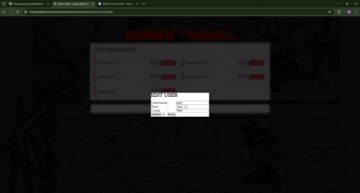

## DragonBall Gacha Simulator

# 🐉 Deskripsi Aplikasi
*DragonBall Gacha Simulator* adalah sebuah aplikasi web berbasis PHP Native yang menggabungkan elemen permainan sederhana (clicker) dengan sistem koleksi karakter (gacha). Proyek ini dibuat untuk memenuhi tugas pemrograman web dengan tema anime Dragon Ball.

## Fitur Utama
# 👤 Halaman User (Pengguna)
1. Sistem Registrasi & Login: Pengguna dapat membuat akun baru dan masuk ke dalam sistem.
2. Dashboard User: Menu utama navigasi ke fitur permainan.
3. Clicker Game (Training):
  - Mini-game interaktif (mirip PopCat).
  - User harus mengklik/tap karakter hingga mencapai target (160 klik).
  - Reward: Setelah mencapai target, user bisa klaim Koin untuk gacha.
4. Gacha System: Menukarkan koin untuk mendapatkan karakter Dragon Ball secara acak (RNG).
5. Collection (Koleksi): Galeri untuk melihat semua karakter yang berhasil didapatkan oleh user.

# 🛡️ Halaman Admin
1. Dashboard Admin: Halaman sambutan untuk administrator.
2. Admin Panel (Manajemen User):
  - Melihat daftar semua user yang terdaftar.
  - Mengedit data user.
  - Menghapus akun user (tidak bisa menghapus akun admin).

## 📂 Struktur Folder
```text
/ (Root Directory)
│
├── db/                     # Berisi file backup database (.sql)
│
├── html_awal/              # File rancangan awal HTML (prototype) sebelum integrasi PHP
│
└── main/                   # Folder utama aplikasi website (Source Code)
    │
    ├── admin/              # Halaman khusus Administrator
    │   ├── admin_dashboard.php  # Tampilan utama dashboard admin
    │   └── admin_panel.php      # Fitur manajemen user (Edit/Hapus data)
    │
    ├── assets/             # Penyimpanan file statis
    │   ├── css/            # File Style.css untuk desain tampilan
    │   ├── js/             # File Script.js untuk logika game & interaksi
    │   └── image/          # Aset gambar program & karakter Dragon Ball
    │
    ├── config/             # Konfigurasi Backend
    │   ├── conn.php        # Script koneksi ke Database
    │   └── function.php    # Fungsi global (Cek Login & Role Admin/User)
    │
    ├── clicker.php         # Halaman game clicker (Training Mode)
    ├── collection.php      # Halaman galeri koleksi karakter user
    ├── dashboard.php       # Dashboard utama menu user
    ├── gacha.php           # Halaman sistem Gacha (RNG)
    ├── index.php           # Halaman depan (Landing Page)
    ├── login.php           # Form Login pengguna
    ├── logout.php          # Script untuk mengakhiri sesi (Logout)
    └── register.php        # Form pendaftaran akun baru
```
## 🛠️ Teknologi yang Digunakan
- Frontend: HTML5, CSS3, JavaScript.
- Backend: PHP (Native).
- Database: MySQL.

## Demo Aplikasi
Video Simulasi Website 
-

## 🚀 Cara Instalasi
1. Clone/Download repositori ini.
  - Pindahkan folder proyek ke dalam folder server lokal (misal: htdocs pada XAMPP).

2. Database:
  - Buat database baru di phpMyAdmin dengan nama dragonball (atau sesuaikan).
  - Import file .sql yang ada di dalam folder db/.

3. Konfigurasi:
  - Buka file config/conn.php.
  - Sesuaikan username, password, dan nama database jika berbeda.

4. Jalankan:
  - Buka browser dan akses localhost/nama-folder-proyek.

## 👷‍♂️ Kontributor
1. Nalendra Wicaksana (H1D024073)
2. Cahya Azali Desta Putri (H1D024088)
3. Revaldi Enzha Agviandry P (H1D024094)
